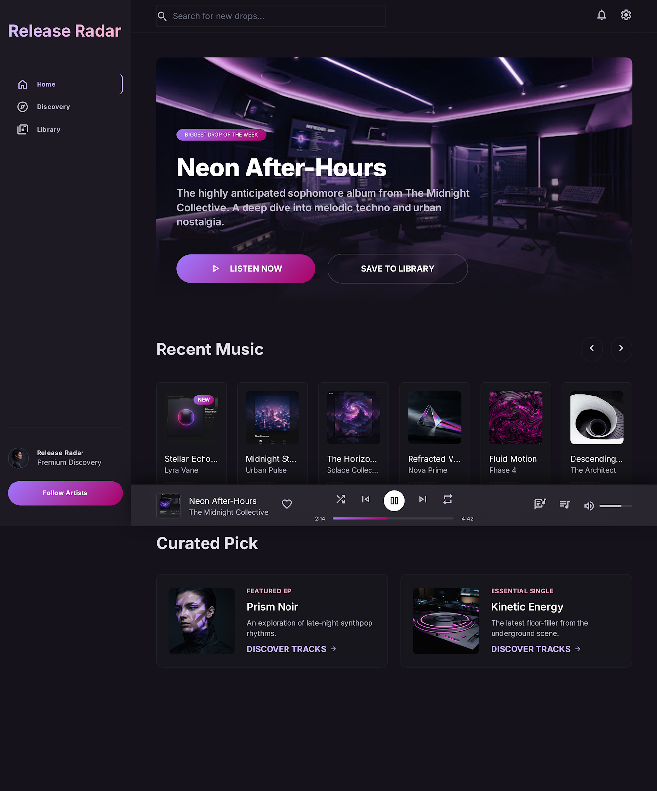
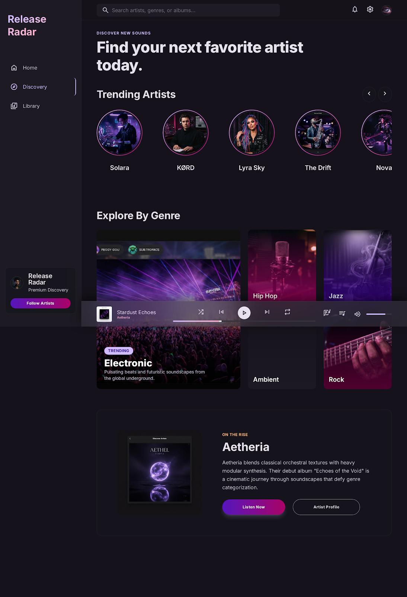
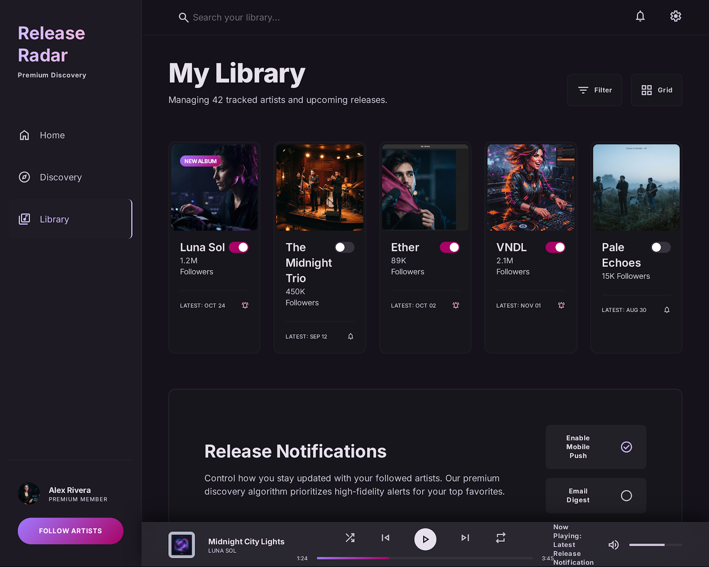
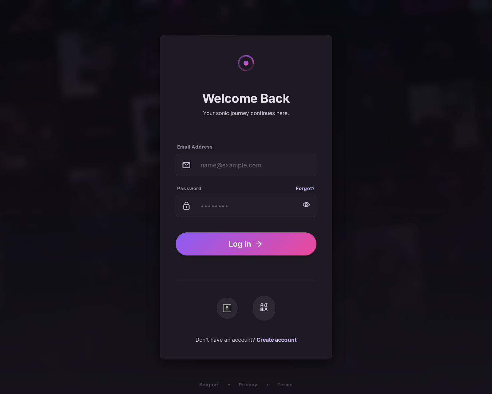
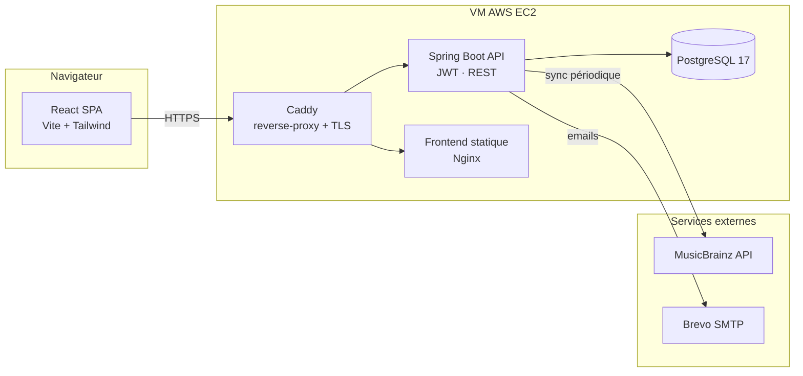

<div align="center">


# Release Radar

**Suivez vos artistes préférés et ne manquez plus jamais une sortie.**

Une application web qui surveille les nouvelles sorties musicales de vos artistes suivis
(via [MusicBrainz](https://musicbrainz.org/)) et vous notifie par email.

[](https://openjdk.org/projects/jdk/21/)
[](https://spring.io/projects/spring-boot)
[](https://react.dev/)
[](https://www.postgresql.org/)
[](.github/workflows/ci-cd.yml)

🌐 **En production : [releaseradarapp.com](https://releaseradarapp.com)**

</div>

---

## Sommaire

- [Fonctionnalités](#fonctionnalités)
- [Aperçu](#aperçu)
- [Architecture](#architecture)
- [Stack technique](#stack-technique)
- [Choix techniques](#choix-techniques)
- [Démarrer en local](#démarrer-en-local)
- [Tests](#tests)
- [API](#api-principaux-endpoints)
- [Déploiement](#déploiement)
- [Roadmap](#roadmap)

---

## Fonctionnalités

- 🔎 **Recherche d'artistes** via l'API MusicBrainz, avec suivi/désuivi.
- 🆕 **Fil des sorties** des artistes suivis, trié par date, avec le rôle de l'artiste
  (principal, collaboration, featuring) déduit des _artist-credits_ MusicBrainz.
- 📧 **Notifications par email** (Brevo) lorsqu'une nouvelle sortie est détectée.
- 🔄 **Synchronisation automatique** depuis MusicBrainz (scheduler) + sync manuelle (admin).
- 🔐 **Authentification complète** : inscription avec **vérification d'email**, JWT à durée
  courte + **refresh tokens** révocables, **rate-limiting** anti-brute-force.
- 👤 **Gestion du compte & RGPD** : changer email/mot de passe, **export des données** (JSON),
  **suppression de compte** (droit à l'effacement), consentement CGU horodaté.
- 🛠️ **Espace admin** : gestion des utilisateurs/rôles et déclenchement des synchronisations.
- 🎨 **Interface soignée** (thème sombre, responsive) construite à partir d'un design system dédié.

## Aperçu

> Les visuels ci-dessous sont les **maquettes** ([`stitch_release_radar/`](stitch_release_radar/))
> dont l'interface s'inspire directement.

|                    Accueil — nouvelles sorties                     |                 Découverte d'artistes                 |
| :---------------------------------------------------------------: | :---------------------------------------------------: |
|      |  |
|                         **Ma bibliothèque**                        |                     **Connexion**                     |
|        |  |

## Architecture

Monorepo **backend / frontend**, orchestré par Docker Compose. En production, les images sont
construites par la CI puis **tirées** par la VM (aucune compilation sur le serveur).



**Arborescence :**

```text
ReleaseRadar/
├── backend/                 # Spring Boot (Java 21, Maven) — API REST + JWT + scheduler
│   ├── src/main/java/dev/theolambert/release_radar/
│   │   ├── auth/            # inscription, login, refresh tokens, vérification email
│   │   ├── me/              # self-service compte & RGPD (/api/me)
│   │   ├── artist/          # suivi d'artistes
│   │   ├── release/         # sorties
│   │   ├── musicbrainz/     # client MusicBrainz + service de synchronisation
│   │   ├── email/           # envoi d'emails (Brevo)
│   │   ├── admin/           # endpoints d'administration
│   │   ├── security/        # SecurityConfig, filtres JWT & rate-limiting
│   │   └── common/          # gestion globale des exceptions
│   └── src/main/resources/db/migration/   # migrations Flyway (V1 → V7)
├── frontend/                # React 19 + TS + Vite + Tailwind v4 (build → Nginx)
├── docker-compose.yml       # stack de dev (postgres + app + frontend + adminer)
├── docker-compose.prod.yml  # stack de prod (images GHCR + Caddy)
├── Caddyfile                # reverse-proxy + TLS automatique
├── .github/workflows/       # CI/CD (tests → build → push GHCR → déploiement SSH)
├── DEPLOY-AWS.md            # runbook de déploiement
└── ROADMAP.md               # feuille de route détaillée
```

## Stack technique

| Domaine       | Technologies                                                                              |
| ------------- | ----------------------------------------------------------------------------------------- |
| **Backend**   | Java 21, Spring Boot 4.0, Spring Security, Spring Data JPA, Flyway, Maven                  |
| **Auth**      | JWT (jjwt 0.12, HS256), refresh tokens opaques hachés (SHA-256), Bucket4j + Caffeine       |
| **Frontend**  | React 19, TypeScript, Vite, Tailwind CSS v4, React Router 7, Axios                        |
| **Base**      | PostgreSQL 17, migrations versionnées Flyway                                               |
| **Emails**    | Spring Mail + Brevo (SMTP)                                                                 |
| **Externe**   | API MusicBrainz (données artistes & sorties)                                              |
| **Tests**     | JUnit 5 + Testcontainers (backend), Vitest + Testing Library (frontend)                   |
| **Qualité**   | oxlint + Prettier (frontend), typage strict TS                                            |
| **Infra**     | Docker / Docker Compose, GitHub Actions, GHCR, AWS EC2, Caddy (TLS)                        |

## Choix techniques

Quelques décisions notables et leur justification :

- **Refresh tokens + access token court (15 min).** L'access token JWT est stateless et non
  révocable ; on le garde donc éphémère et on adosse un **refresh token opaque, haché en base
  et à rotation** (un jeton ne sert qu'une fois). Cela permet la **révocation côté serveur**
  (logout, changement de mot de passe) tout en gardant une API sans session.
- **401 vs 403 rigoureux.** Une requête **non authentifiée** (jeton absent/expiré) renvoie **401**
  — ce qui déclenche le rafraîchissement transparent côté front — tandis qu'un **403** est réservé
  aux vrais refus d'autorisation (rôle insuffisant). Les endpoints self-service renvoient **400**
  sur mauvais mot de passe pour ne pas déclencher un refresh à tort.
- **Vérification d'email à l'inscription.** Le compte est créé **désactivé** ; le login est bloqué
  (`DisabledException`) tant que le lien (token 24 h) n'est pas confirmé. Les réponses de renvoi
  sont **uniformes** (anti-énumération de comptes).
- **Rate-limiting applicatif (Bucket4j).** Token buckets par IP sur `/api/auth/**`, buckets en
  mémoire évincés par Caffeine — protège le brute-force sans dépendance externe (Redis).
- **Flyway plutôt que `ddl-auto`.** Schéma **versionné et reproductible** (`V1 → V7`),
  `hibernate.ddl-auto=validate` en garde-fou.
- **Testcontainers en pattern singleton.** Un unique conteneur PostgreSQL démarré une fois et
  partagé entre classes de test (compatible avec le cache de contexte Spring) — suite rapide et
  fidèle à la prod, sans H2.
- **CI qui compile, VM qui tire.** La `t3.micro` (1 Go) est trop juste pour compiler : la CI
  construit et pousse les images sur **GHCR**, la VM ne fait que `docker compose pull`. Le déploiement
  SSH ouvre le port 22 à l'IP du runner via un IAM restreint puis **referme la règle**.
- **Conformité RGPD dès le produit.** Export et suppression des données en self-service, consentement
  CGU horodaté (date + version), pages légales, pas de cookie de tracking (JWT en `localStorage`).

## Démarrer en local

### Prérequis

- **Docker** + **Docker Compose**
- Pour le développement itératif : **JDK 21** (backend) et **Node 22** (frontend)

### Option A — tout via Docker (le plus simple)

```bash
# Générer un secret JWT (clé base64 de 32+ octets)
export JWT_SECRET=$(openssl rand -base64 32)
# (optionnel) identifiants SMTP Brevo pour l'envoi d'emails
export SMTP_USERNAME=... SMTP_PASSWORD=...

docker compose up --build
```

| Service              | URL                                              |
| -------------------- | ------------------------------------------------ |
| API backend          | http://localhost:8080                            |
| Frontend             | http://localhost:3000                            |
| Adminer (DB, dev)    | http://localhost:8081                            |
| PostgreSQL           | `localhost:5432` (`release_radar` / `release_radar`) |

### Option B — développement itératif (hot reload)

```bash
# 1) Base de données seule
docker compose up -d postgres

# 2) Backend (port 8080)
cd backend
export JWT_SECRET=$(openssl rand -base64 32)
./mvnw spring-boot:run

# 3) Frontend (port 5173, proxy /api → :8080)
cd frontend
npm install
npm run dev
```

### Variables d'environnement principales

| Variable                        | Rôle                                                        |
| ------------------------------- | ----------------------------------------------------------- |
| `JWT_SECRET` **(requis)**       | Clé de signature JWT (base64, ≥ 32 octets)                  |
| `SMTP_USERNAME` / `SMTP_PASSWORD` | Identifiants SMTP Brevo (envoi d'emails)                  |
| `MAIL_FROM`                     | Adresse expéditrice validée dans Brevo                     |
| `APP_BASE_URL`                  | URL publique du frontend (liens de vérification d'email)   |
| `APP_CGU_VERSION`               | Version des CGU enregistrée avec le consentement            |

## Tests

```bash
# Backend — JUnit + Testcontainers (nécessite Docker)
cd backend && ./mvnw verify

# Frontend — typecheck + lint + format + tests
cd frontend && npm run check && npm test
```

## API (principaux endpoints)

| Méthode & route                     | Description                                          | Accès  |
| ----------------------------------- | --------------------------------------------------- | ------ |
| `POST /api/auth/register`           | Créer un compte (désactivé jusqu'à vérification)    | public |
| `POST /api/auth/login`              | Se connecter → access + refresh token               | public |
| `POST /api/auth/refresh`            | Renouveler l'access token (rotation)                | public |
| `POST /api/auth/logout`             | Révoquer le refresh token                           | public |
| `POST /api/auth/verify-email`       | Confirmer l'adresse email                           | public |
| `GET /api/artists/search?q=`        | Rechercher un artiste (MusicBrainz)                 | user   |
| `GET/POST /api/artists`             | Lister / suivre un artiste                          | user   |
| `DELETE /api/artists/{id}`          | Ne plus suivre                                      | user   |
| `GET /api/releases`                 | Sorties des artistes suivis                         | user   |
| `GET /api/me` · `GET /api/me/export`| Profil · export des données (RGPD)                  | user   |
| `PATCH /api/me/email` · `/password` | Changer d'email / de mot de passe                   | user   |
| `DELETE /api/me`                    | Supprimer son compte (droit à l'effacement)         | user   |
| `POST /api/admin/sync`              | Synchroniser toutes les sorties                     | admin  |
| `GET /api/admin/users`              | Gérer les utilisateurs                              | admin  |

## Déploiement

L'application tourne sur une VM **AWS EC2** (free tier), derrière **Caddy** (TLS automatique).
Le pipeline **GitHub Actions** enchaîne : tests → build des images → push sur **GHCR** →
déploiement SSH (la VM se contente de `docker compose pull && up -d`).

📄 Procédure complète (secrets, IAM, DNS, TLS) : **[`DEPLOY-AWS.md`](DEPLOY-AWS.md)**.

## Roadmap

L'avancement détaillé (étapes réalisées et à venir : SEO, 2FA, etc.) est suivi dans
**[`ROADMAP.md`](ROADMAP.md)**.

---

<div align="center">
<sub>Développé par <a href="mailto:lambertheo@gmail.com">Théo Lambert</a> · projet personnel</sub>
</div>
